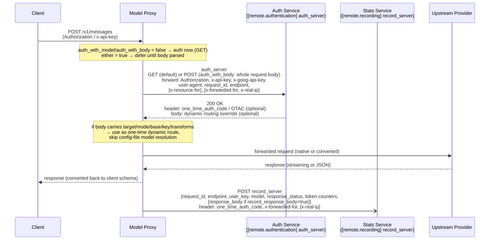

# Model Proxy v3

One proxy, five API schemas. Talk to **Claude**, **Gemini**, **OpenAI Responses**,
and **OpenAI Chat Completions** models through a single endpoint, no matter which
API format your client speaks.

The proxy accepts requests in the Claude Messages, Gemini (GenerateContent /
Interactions), OpenAI Responses and Chat Completions format, converts them
for whatever upstream provider you've configured, and converts the response back.
On top of translation it handles exact / wildcard / catch-all model routing,
composite aliases (weighted, primary+fallback, fusion fan-out, planner→executor
coordinator), schedule-based timetable routing, per-model request/response
transform hooks, global and per-alias token limits, privacy / compression
sidecars, and a web + terminal dashboard for per-model, per-tool, and per-agent
usage stats and some configs modification.

```
 Claude / Gemini genContent & interactions / OpenAI Responses & Chat Completions
                               │
                               ▼            privacy-filter
                        ┌─────────────┐     compression
     sidecar plugins <- │ Model Proxy │ ->  image-fetch & encoding
                        └─────────────┘     auth & usage stats
                               │ 
        ┌──────────────┬───────┴───────┬──────────────┐
        ▼              ▼               ▼              ▼
   Anthropic        Gemini         OpenAI Chat      OpenAI
   Messages       GenContent &     Completions      Responses
                  Interactions     upstream         upstream
                  upstream
```

### Proxy ↔ remote auth & stats service

The two optional remote sidecars (`[remote.authentication] auth_server` and
`[remote.recording] record_server`) can be the **same** service or two separate ones.
`auth_server` gates admission; `record_server` collects per-request usage after the
response. When they are the same service, the proxy can authenticate and
report stats against one backend.



**Auth dynamic-routing override (response body).** The auth service MAY respond
with a JSON body that acts as a **one-time alias config entry** — the same shape
as a `[models.*]` inline table. When present, the proxy uses it directly for
this single request and skips resolving the model from `[models.*]` / `[composite]`
/ `[schedule]` in the config file. All fields are optional; omitted fields fall
back to the normal inheritance chain (`[default_upstream]` → section → entry):

| Body field | Type | Meaning |
|---|---|---|
| `target` | string | Real upstream model id to send (like an alias `target`). |
| `mode` / `upstream_mode` | string | Upstream protocol: `anthropic-messages`, `openai-completions`, `openai-responses`, `gemini-generatecontent`, `gemini-interactions`. |
| `base` / `base_url` | string | Upstream base URL. |
| `key` / `api_key` | string *(optional)* | Upstream API key for this request only. When omitted, the proxy uses the caller's key (subject to `auth_passthrough_with`) or the config-inherited key. |
| `transforms` | string *(optional)* | Comma-separated `[transforms.*]` set names to apply. When omitted, no transforms are attached beyond what config resolution already yields. |

> The override is **per-request and ephemeral** — it is never cached, never
> written to config, and does not persist across requests. If the auth response
> body is empty or not JSON, the proxy falls back to normal config resolution.
> Requires `auth_with_model = true` so the auth call runs after body parsing
> (the proxy needs the requested model id and the override before routing).

See [Auth & Stats Service Protocol](#auth--stats-service-protocol) below for the
full wire-level contract.

## Features

- **Five API formats in, any provider out** — accept requests in any of these schemas:
  - `/v1/messages` — Claude Messages API
  - `/v1beta/models/{model}:generateContent` (+ `:streamGenerateContent`, `:countTokens`) — Gemini GenerateContent API
  - `/v1/interactions` — Gemini Interactions API
  - `/v1/responses` — OpenAI Responses API
  - `/v1/chat/completions` — OpenAI Chat Completions API (always enabled; per-model routed passthrough)
- **Embeddings** — `/v1/embeddings` proxied to an OpenAI-compatible upstream.
- **Model-based routing** — route each model name to its own upstream URL, API key,
  and protocol via a simple TOML config. Exact model keys are supported in every
  `[models.*]` category; provider wildcards (`claude-*`) and the final catch-all
  (`*`) are scoped as described in [Model Routing & Aliases](#model-routing--aliases).
- **Composite aliases** — group several models under one name with weighted-random,
  primary/fallback (with runtime share decay on failure), fusion fan-out, or a
  planner→executor coordinator that hands off once a trigger tool appears.
- **Schedule aliases** — timetable-based routing: pick which model (or composite)
  serves a request based on server-local hour-of-day and day-of-week, with a
  fallback target for any time outside the configured windows.
- **Transform hooks** — per-model / per-upstream request and response rewriting via
  five lifecycle hooks (`request_ingress`, `before_conversion`, `before_upstream`,
  `after_upstream`, `response_egress`), with Tier-1 field ops (rename / set / default
  / remove / map_value) and Tier-2 builtins for cross-message fixes. See
  [Configuration Reference](#configuration-reference).
- **Extended thinking / reasoning** — Claude-style thinking blocks, with conversion to
  OpenAI `reasoning_effort` for upstreams that need it. Handles tag-based
  (`<think>...</think>`) and `reasoning_content` extraction, including streaming and
  cross-chunk tool-call fragment stitching.
- **Usage accounting** — per-model token and request stats, plus per-tool and
  per-agent stats (request/response counts, payload size, block counts), viewable
  in a web dashboard or a live terminal UI.
- **Token limits** — global and per-alias token caps over a configurable window (sliding `Nh`/`Nd` or calendar `1w`/`1m`). Returns HTTP 413 when exceeded.
- **Sidecars** — optional privacy-filter (sidecar or local hash-only mode),
  compression, and image-encode sidecars for redacting, shrinking, or fetching
  request payloads before they reach the upstream.
- **Runs anywhere** — Node.js server or Docker.

## Quick Start

### 1. Install

```bash
git clone <repo-url>
cd model_proxy_v3
npm install
```

> **Node ≥ 19 recommended.** The proxy uses the Web Crypto global (`crypto.randomUUID()`)
> available natively in Node ≥ 19. On Node 18.17–18.x, either:
> - export `NODE_OPTIONS=--experimental-global-webcrypto` before running any command
>   (`npm run server`, `npm run test:unit`, etc.); or
> - in each source file that calls `crypto.randomUUID()`, add at the top:
>   ```ts
>   import { webcrypto } from 'node:crypto';
>   const crypto = webcrypto;
>   ```
> Node < 18.17 is not supported.

### 2. Configure

Copy the example config and edit it:

```bash
cp proxy_config.toml_example proxy_config.toml
```

> **Note — inline `#` comments are supported.** `proxy_config.toml` is parsed
> by a hand-rolled TOML reader (`src/utils/config-loader.ts → parseSimpleToml`)
> that strips trailing comments before matching values. Comments must be preceded
> by at least one space (standard TOML convention), e.g.
> `filter_mode = "local"  # sidecar | local`. A bare `#` with no leading space
> inside a quoted value (e.g. `api_key = "abc#def"`) is preserved correctly.
> Standalone `#`-only lines are always fine.

A minimal `proxy_config.toml` looks like this:

```toml
# Remote auth sidecar — validates proxy endpoint auth headers.
# [remote.authentication]
# auth_server = "https://auth.example.com/validate"
# auth_with_model = false          # when true, defers auth until after body parsing
                                   # and forwards requested model id as x-resource-for
# auth_with_body = false           # when true, POSTs the parsed request body to auth_server
# auth_passthrough_with = "user_key"   # controls which key is passed upstream:
                                       # "user_key" (default) or "config_key"

# Remote stats sidecar — POSTs per-request usage records to an HTTP collector.
# Includes request_id, endpoint, raw user_key, model, response_status, and token counters.
# [remote.recording]
# record_server = "http://127.0.0.1:8080/model-usage"
# record_response_body = false     # when true, each record also includes the constructed response body

# Global upstream defaults — applied ONLY to models that are NOT claimed by
# any `[models.*]` category section below. A model name that falls through
# every section's exact / wildcard / catch-all lookup gets routed here.
[default_upstream]
default_base_url = "https://api.your-provider.com"
# default_api_key = "your-key"   # used in config_key mode or as fallback for [models.FREE]

# Claude models, spoken to in native Anthropic format
[models.claude]
upstream_mode = "anthropic-messages"
base_url = "https://api.anthropic.com"
api_key = "your-claude-key"
"claude-sonnet-4-6" = {}                    # exact entry; inline table {target, base_url, api_key, mode} — empty fields inherit from section
"claude-*" = {}                             # prefix wildcard — catch-all for every other claude-* model

# Gemini models, spoken to in native Gemini format
[models.gemini]
upstream_mode = "gemini-generatecontent"
base_url = "https://generativelanguage.googleapis.com"
api_key = "your-gemini-key"
"gemini-*" = {}

# Everything else goes here (OpenAI-compatible). Empty entry fields inherit
# from the section, then from `[default_upstream]` defaults.
[models.default]
upstream_mode = "openai-completions"
base_url = "https://api.your-provider.com"   # section base_url overrides [default_upstream].default_base_url
"*" = {}                                     # final catch-all for this section
"deepseek/deepseek-v3.2" = {}

# /v1/embeddings — OpenAI-compatible. The proxy appends `v1/embeddings` to
# `base_url`, so set the **API root** (e.g. `https://integrate.api.nvidia.com`,
# NOT `…/v1`). When `api_key` is set, it always overrides any caller-supplied
# header on `/v1/embeddings` — see the "Who wins" tables in
# docs/routing-and-aliases.md. Model entries are exact-match only; bare model names without
# the upstream's required prefix (e.g. `nvidia/`) will fail at the upstream.
[models.EMBEDDING]
upstream_mode = "openai-completions"   # value is informational — the proxy hardcodes this for /v1/embeddings
base_url = "https://integrate.api.nvidia.com"
api_key = "nvapi-..."
"nvidia/nemotron-3-embed-1b" = {}
```

Key ideas:

- **Categories** group models by provider: `[models.claude]`, `[models.gemini]`,
  `[models.default]`, etc.
- **`upstream_mode`** picks the protocol: `anthropic-messages`, `gemini-generatecontent`,
  `gemini-interactions`, `openai-completions`, or `openai-responses`.
- **`sdk://` target URLs** route supported Claude/OpenAI upstream calls through the
  local SDK handler instead of plain HTTP fetch, while still using the configured
  `upstream_mode` for request/response shape.
- **Per-model overrides** use an inline table: `"my-model" = {target = "real-name", base_url = "...", api_key = "..."}`.
  Empty fields inherit from the category. Both the canonical keys (`upstream_mode`, `base_url`,
  `api_key`) and the short aliases (`mode`, `url`, `key`) are accepted; when both are present
  the canonical form wins.

> **Note — `anthropic-messages` and extended thinking:**
> When `upstream_mode = "anthropic-messages"` is used with a third-party Anthropic-compatible
> endpoint (e.g. MiniMax at `api.minimaxi.com/anthropic`), the proxy passes the client's
> `thinking` field through as-is. If the client sends `{"type": "adaptive"}` the upstream
> model will respond with thinking blocks; if the client omits `thinking` entirely, the proxy
> injects `{"type": "disabled"}` as a safe default (needed for DeepSeek-compatible endpoints
> that otherwise default to thinking mode). On a **fresh conversation** (no prior assistant
> turns containing thinking blocks), a client-sent `{"type": "enabled"}` will be silently
> dropped — use `"adaptive"` instead, which the model handles autonomously.

> **Note — synthetic thinking-block signatures (Claude→OpenAI→Claude only):**
> Anthropic's spec marks `signature` as REQUIRED on thinking content blocks, and clients such
> as `@ai-sdk/anthropic` reject responses missing it. Upstreams reached via the conversion
> paths (`openai-completions` / `openai-responses`, and the `sdk://` handler) emit reasoning
> without a signature, so the proxy synthesizes a constant placeholder
> (`SYNTHETIC_THINKING_SIGNATURE` = 'synthetic'). This **only** applies to the Claude→OpenAI→Claude
> round-trip: the reverse converter round-trips reasoning via `reasoning_content` and drops the
> signature before the upstream call, so the placeholder is never verified. For
> `upstream_mode = "anthropic-messages"` the proxy does **not** synthesize anything — it is a
> pure pass-through in both directions, so the upstream's own signature is preserved:
>   - Client enables thinking + provides prior thinking blocks → forwarded as-is; signature passes through. ✓
>   - Client enables thinking + provides prior thinking blocks but the signature is missing/garbage → forwarded as-is; a real Anthropic/Bedrock upstream rejects with HTTP 400.

> **Note — `thinking.budget_tokens` vs `max_tokens`:** on `POST /v1/messages` and
> `POST /v1/messages/count_tokens`, when `thinking` is enabled the validator reduces
> `thinking.budget_tokens` down to `max_tokens` if the budget would otherwise exceed it.
> If you send `anthropic-beta: interleaved-thinking-2025-05-14`, the budget is left
> unchanged (interleaved thinking may consume the full context window). If `max_tokens`
> is below `1024` with thinking enabled and a non-null budget, validation throws with
> a message explaining the minimum.

> **Note — `kimi-k2.7-code` and `thinking_budget` collision:** Moonshot's
> `kimi-k2.7-code` maps `reasoning_effort: "medium"` to a fixed
> `thinking_budget = 32768`, so any request with `max_tokens ≤ 32768` fails with
> `InvalidParameter: max_completion_tokens [N] must be greater than thinking_budget [32768]`.
> Under `[general]`, set `budget_to_effort_high = 0` — the proxy then emits
> `reasoning_effort: "high"` for any thinking budget. if set 
> `budget_to_effort_low = 32768`
> `budget_to_effort_medium = 65536`
> `budget_to_effort_high = 128000`
> map `reasoning_effort: "low"` would avoid the limit of `kimi-k2.7-code`.
- **Tag-based reasoning extraction (`openai-completions` only):** when an upstream replies
  with reasoning wrapped in `<think>...</think>` or `<thinking>...</thinking>` tags, the proxy splits
  the content into the endpoint's native reasoning field. `/v1/messages` returns it as a
  Claude `thinking` block; `/v1/responses` returns it as a `reasoning` output item plus an
  embedded `reasoning_text` part for round-trip; `/v1/interactions` returns it as a
  `thought` output item; `/v1beta/models/<model>:generateContent` returns it as a Gemini
  `thought` part. The tag itself is stripped from the user-visible text. This applies to
  both streaming and non-streaming responses; the streaming path stitches tags that cross
  SSE chunk boundaries before extraction.
- **`reasoning_content` field round-trip (`openai-completions`, Gemini endpoints):** reasoning
  models such as DeepSeek emit thinking as a dedicated `reasoning_content` field on the delta
  rather than inline tags. The proxy extracts it the same way as tag-based reasoning (emitted as
  a Gemini `thought` part, Claude `thinking` block, etc.) and ensures it is replayed on the
  assistant turn in subsequent requests — required by DeepSeek-compatible upstreams that reject
  conversations where a prior thinking turn omits `reasoning_content`. Tool-call streaming is
  also handled: DeepSeek fragments a single tool call across multiple SSE chunks (first chunk
  carries `id`+`name`+partial args, continuation chunks carry only more arg text). The proxy
  accumulates these fragments and flushes one complete `functionCall` part per tool call when
  `finish_reason` arrives, avoiding name-less `call_undefined` entries in the client's history.
- **Wildcards** (`claude-*`) apply only in the provider/default sections listed in
  [Model Routing & Aliases](#model-routing--aliases); the **catch-all** (`*`) is only the final
  `[models.default]` fallback for anything not claimed earlier.

See [`proxy_config.toml_example`](./proxy_config.toml_example) for a fully commented config
covering every section and option.

### 3. Run

```bash
npm run server        # starts on http://localhost:8788
```

Send a request:

```bash
curl http://localhost:8788/v1/messages \
  -H "Content-Type: application/json" \
  -H "x-api-key: your-key" \
  -d '{
    "model": "claude-sonnet-4-5",
    "max_tokens": 1024,
    "messages": [{"role": "user", "content": "Hello!"}]
  }'
```

The proxy reads `proxy_config.toml` from the working directory by default. Point it
elsewhere with `PROXY_CONFIG_PATH=./other.toml npm run server`. Change the port with
`PORT=7777`.

### 4. Watch live stats (optional)

Start with the terminal dashboard:

```bash
TUI=true npm run server
```

You get a live view of configured models, token usage, response times, and tool stats.
Press `c` to edit composite aliases, `s` to edit schedule aliases, `t` to send a test
request, `r` to reload config, `l` to edit the global token limit, `d` to open the
statistics overlay, `p` to open the tools blocklist overlay, `Ctrl+U` to dump usage to
JSONL now, `Ctrl+C` to quit. A web dashboard is also available at `GET /dashboard`.

When `TUI=true` or `DUMP=true` is set, token stats are appended to
`model_proxy_tokens.jsonl` in the working directory. Each line is one JSON dump:

```json
{
  "date": "2026-07-15",
  "timestamp": 1784112345,
  "lastDumpTs": 1784109999,
  "modelStats": [
    {
      "model": "claude-sonnet-4-6",
      "requests": 12,
      "failed_requests": 0,
      "input_tokens": 12345,
      "cached_tokens": 0,
      "cache_written_tokens": 0,
      "output_tokens": 6789,
      "total_tokens": 19134
    }
  ],
  "toolStats": [
    { "name": "Read", "agent": "unknown", "req": 3, "resp": 1, "len": 2048, "blocked": 0 }
  ],
  "heatmapEvents": {
    "models": { "ab12": "claude-sonnet-4-6" },
    "sequences": [{ "ts": 1784112300, "values": 19134, "id": "ab12" }]
  }
}
```

Fields:
- `date`: local `YYYY-MM-DD` bucket for the dump.
- `timestamp`: dump time in Unix seconds.
- `lastDumpTs`: previous dump timestamp. `0` means a full snapshot; non-zero means
  `heatmapEvents` is a delta since that timestamp.
- `modelStats`: cumulative per-model totals for that date.
- `toolStats`: optional cumulative per-tool/per-agent totals.
- `heatmapEvents`: token events used for the Tokens Panel and rolling global token
  limit. Current files use the compact `{models, sequences}` shape, where model
  names are mapped to short ids and each sequence stores `{ts, values, id}` in Unix
  seconds. Older files with `heatmapEvents: [{timestamp, values, model}]` are still
  accepted.
- `compositeAliasStates`: optional persisted per-alias token-limit event log,
  written by day-rollover/full-snapshot dumps. Each alias entry stores
  `{limit, duration, events: [{ts, tokens}]}`; events are kept in Unix seconds
  and pruned to the 31-day retention bound on load. Legacy rows using the older
  `compositeLimitWindows` shape (accumulator-based) are still accepted but
  restore with an empty event log since an accumulator cannot be reconstructed
  into per-event history.

On startup, the proxy avoids double-counting persisted stats as follows:
- `modelStats`, `toolStats`, and `compositeAliasStates` are loaded only from the
  latest dump for each retained date because they are cumulative snapshots.
- `modelStats` from those latest per-day dumps are summed across days to rebuild the
  all-time dashboard totals.
- `heatmapEvents` are loaded from all retained rows, because delta rows and multiple
  proxy instances can contain different events. The loader skips events older than
  the retention cutoff, skips events at or before a row's non-zero `lastDumpTs`, and
  deduplicates by `timestamp:values:modelId` before adding them to memory.

## API Endpoints

| Endpoint | Purpose |
|---|---|
| `POST /v1/messages` | Claude Messages API |
| `POST /v1/messages/count_tokens` | Count tokens (Claude/OpenAI format) |
| `POST /v1/responses` | OpenAI Responses API |
| `POST /v1/responses/input_tokens` | Count input tokens for a Responses request (forwarded to `/v1/responses/input_tokens` under `openai-responses`, or bridged through Chat Completions token counting under other modes) |
| `POST /v1/responses/compact` | Compact a Responses conversation (forwarded to `/v1/responses/compact` under `openai-responses`, or bridged through Chat Completions under other modes) |
| `POST /v1beta/models/{model}:generateContent` | Gemini content (also `:streamGenerateContent`, `:countTokens`) |
| `POST /v1/interactions` | Gemini Interactions API |
| `POST /v1/embeddings` | Embeddings (proxied to an OpenAI-compatible upstream) |
| `GET /v1/models` | List available models (no auth required) |
| `GET /dashboard` | Web dashboard for config + stats |
| `GET /config-reload` | Reload config from `PROXY_CONFIG_CONSUL` or `PROXY_CONFIG_APOLLO`. Only meaningful when a remote config source is set; returns `400`/`500` otherwise. Clears the config cache and re-fetches. |
| `GET /health` (also `GET /`) | Health check. Probes the resolved default-category / `[default_upstream]` upstream `/v1/models`; returns `{status:"ok", models, cached, version}` on success or `404` when no models are reachable. No auth required. |
| `GET /favicon.ico` | Returns `204 No Content` (browser plumbing). |
| `/{protocol}/{host}/...` dynamic route | Per-request upstream override. See [Dynamic routing](./docs/api-endpoints.md#dynamic-routing). |

A Gemini `/v1/models/{model}:...` variant exists for each `/v1beta/models/{model}:...`
endpoint. `:countTokens` is supported too: native Gemini routes forward to Gemini
`countTokens`, while non-Gemini upstream modes are bridged through the proxy's token-counting path.
For streaming conversions, the proxy forwards final upstream usage where the upstream emits it: OpenAI Chat Completions uses `stream_options.include_usage`, Gemini streams use final `usageMetadata` / interaction usage, and cache-read tokens are preserved through Claude/Responses usage fields when available.
Full request/response examples live in the [API reference docs](#documentation).

### Supported `upstream_mode`

Each endpoint can be routed to one or more upstream API families (`upstream_mode`).
The mode is selected by the route's `defaultMode` / model config:

| Client endpoint | `anthropic-messages` | `openai-completions` | `openai-responses` | `gemini-generatecontent` | `gemini-interactions` |
|---|---|---|---|---|---|
| `POST /v1/messages` | **Native passthrough** to `/v1/messages`; request stays Claude Messages format end-to-end. | **Direct transform**: Claude Messages → Chat Completions → Claude Messages. If input is already OpenAI-shaped, it can pass through. | **Indirect transform via `openai-completions`**: Claude Messages → Chat Completions → Responses `input` → Claude Messages. Basic tools and streaming are supported; `max_tokens` is rewritten to `max_output_tokens`. | **Direct transform**: Claude Messages → Gemini generateContent → Claude Messages. | **Direct transform**: Claude Messages → Gemini Interactions/generateContent-compatible upstream → Claude Messages. |
| `POST /v1/responses` | **Direct transform**: Responses `input`/`instructions` → Claude Messages → Responses. Text and tool-use are supported for non-streaming and streaming. | **Direct transform**: Responses → Chat Completions → Responses. For `api.qnaigc.com`, keeps legacy `max_tokens`; otherwise uses `max_completion_tokens`. | **Native passthrough** to `/v1/responses`. | **Direct transform via Claude Messages**: Responses → Claude Messages → Gemini generateContent → Claude Messages → Responses. | **Direct transform via Claude Messages**: Responses → Claude Messages → Gemini Interactions/generateContent → Claude Messages → Responses. |
| `POST /v1/chat/completions` | **Convert passthrough**: Chat Completions body is converted to Claude Messages format and forwarded to `/v1/messages`; response (streaming and non-streaming) is converted back to OpenAI completions format. Tool schema types are lowercased; `content: ""` on assistant messages with `tool_calls` is normalized to `null`; consecutive tool messages are grouped into one user turn. | **Native passthrough**. Uses the resolved per-model route; composite aliases and `target`-mapped model ids are resolved and the `model` field in the forwarded body is rewritten to the target model id. | **Transform passthrough**: Chat Completions body is converted to Responses `input` and forwarded to `/v1/responses` using the resolved per-model route. | **Transform passthrough**: Chat Completions body (including `image_url` blocks) is converted to Gemini `generateContent` body (`inline_data` for data-URI images; http(s) image URLs are fetched server-side with an SSRF guard) and forwarded to `:generateContent` / `:streamGenerateContent?alt=sse`. Text deltas and `finishReason` round-trip; tool-call/thinking response parts and any model-generated image output are dropped (response schemas for Claude Messages and OpenAI Completions do not carry image output — see [image I/O notes](./docs/api-endpoints.md#image-inputoutput-across-format-boundaries)). | Same as `gemini-generatecontent`; not separately wired today. |
| `POST /v1beta/models/{model}:generateContent` / `:streamGenerateContent` | **Indirect transform via `openai-completions`**: generateContent → Chat Completions → Claude Messages → generateContent. Forwards upstream to `/v1/messages`; text, tool calls, and streaming text deltas return as Gemini `candidates[].content.parts`; tool calls become `functionCall` parts. | **Direct transform**: generateContent → Chat Completions → generateContent. Forwards upstream to `/v1/chat/completions`. | **Indirect transform via `openai-completions`**: generateContent → Chat Completions → Responses `input` → generateContent. Forwards upstream to `/v1/responses`; `system`/`developer` messages become Responses `instructions`; content-part arrays are normalized to text. | **Native passthrough** to `:generateContent` / `:streamGenerateContent` using the configured Gemini API version. | **Native Gemini-family route**; forwards to Gemini generateContent/stream endpoint using Interactions-compatible mode. |
| `POST /v1/interactions` | **Indirect transform via `openai-completions`**: Interactions → Chat Completions → Claude Messages → Interactions. Forwards upstream to `/v1/messages`; text, tool calls, and streaming text deltas return in Interactions shape. | **Direct transform**: Interactions → Chat Completions → Interactions. Forwards upstream to `/v1/chat/completions`. | **Indirect transform via `openai-completions`**: Interactions → Chat Completions → Responses `input` → Interactions. Forwards upstream to `/v1/responses`; `system`/`developer` messages become Responses `instructions`; content-part arrays are normalized to text. | **Native Gemini-family route**; forwards to Gemini generateContent/stream endpoint. | **Native Gemini-family route**; forwards to Gemini generateContent/stream endpoint using Interactions-compatible mode. |
| `GET /v1/models` | Passthrough model listing; no `upstreamMode` conversion is applied. | Passthrough model listing; no `upstreamMode` conversion is applied. | Passthrough model listing; no `upstreamMode` conversion is applied. | Passthrough model listing; no `upstreamMode` conversion is applied. | Passthrough model listing; no `upstreamMode` conversion is applied. |
| `POST /v1/embeddings` | Not supported. | **Only supported mode**; forwards to OpenAI-compatible embeddings upstream. | Not supported. | Not supported. | Not supported. |

Notes:
- **Native passthrough** means the client endpoint and upstream API family already match, so the request body is not converted to another provider's format.
- **Direct transform** means the proxy converts directly between the client endpoint format and the selected upstream family, then converts the response directly back to the client endpoint shape.
- **Direct transform via Claude Messages** means Responses uses Claude Messages as its internal bridge before calling Gemini; it does not go through `openai-completions`.
- **Indirect transform via `openai-completions`** means the request body is routed through OpenAI Chat Completions as an intermediate shape before reaching the target upstream family. This covers two cases: (a) Gemini endpoint input becomes Chat Completions, then becomes Claude Messages or OpenAI Responses; (b) `/v1/messages` routed to an `openai-responses` upstream becomes Chat Completions, then Responses `input`. This reuses the Chat Completions middle mode for code reuse while preserving the original client endpoint response shape.
- Direct transforms are preferred long-term for endpoint fidelity. The current `/v1/interactions` → `anthropic-messages` / `openai-responses` routes use the indirect `openai-completions` bridge for code reuse; see [Routing transform review](./docs/routing-review.md) for tradeoffs and recommendations.


### Endpoint details

Additional endpoint behavior is documented in [`docs/api-endpoints.md`](./docs/api-endpoints.md):

- **Dynamic routing** — per-request upstream override routes `/{protocol}/{host}/...` with an SSRF allowlist (`ALLOWED_HOSTS`).
- **Image input/output across format boundaries** — wire shapes, source-shape handling, who fetches HTTP image URLs, and the model-generated-image limits.
- **OpenAI prompt caching fields** — which of `prompt_cache_key` / `prompt_cache_options` / `prompt_cache_breakpoint` survive each cross-mode conversion.
- **Dashboard API** — the `/dashboard/api/*` JSON routes, optional bearer token, and stats keying by resolved model id.

## Model Routing & Aliases

Incoming model names resolve through three stacked logic levels (see the
[Routing Hierarchy](#routing-hierarchy-logic-levels) table below):

- **Level 1 — `[models.*]`** — exact key → `prefix-*` wildcard → `*` catch-all lookup,
  with `base_url` / `api_key` / `upstream_mode` inherited per-entry → section →
  `[default_upstream]`. `[models.FREE]` and `[models.EMBEDDING]` are exact-only;
  in `[models.FREE]` the configured key always wins, elsewhere the caller's key wins
  by default (`auth_passthrough_with`).
- **Level 2 — `[composite]`** aliases:
  - **share / primary+fallback** — weighted random or ordered fallback, with runtime
    share decay when a target keeps failing, plus optional per-alias `token_limit`.
  - **fusion** — fan-out to parallel panel models with an optional judge and synth.
  - **coordinator** — planner → executor hand-off: routes to the planner until a trigger
    tool call (`ExitPlanMode`, `Edit`, `Write`, …) appears in the conversation history.
- **Level 3 — `[schedule]`** aliases — pick one target by server-local hour-of-day /
  day-of-week windows, with an empty-window fallback target.
- **Token limits** — global (`general.global_token_limit`) and per-alias caps over
  sliding (`1h`–`6d`) or calendar (`1w`/`1m`) windows; HTTP 413 when exceeded.

The full reference — category lookup priority tables, `base_url`/`api_key` override and
"who wins" rules, every composite/fusion/coordinator/schedule option, the token-limit
windowing engine, and worked examples — lives in
[`docs/routing-and-aliases.md`](./docs/routing-and-aliases.md).

## Routing Hierarchy (Logic Levels)

The proxy has **three logic levels**, stacked bottom-up. Each level chooses *which
level below* gets to serve this request:

```
                        ┌────────────────────────────────┐
   Level 3 (top)        │  [schedule]                   │  ← timetable (hour-of-day, day-of-week)
                        │  "what should serve *now*?"   │
                        ├────────────────────────────────┤
   Level 2 (middle)     │  [composite]                  │  ← share / primary+fallback / fusion fan-out / coordinator
                        │  "split or sequence across N?" │
                        ├────────────────────────────────┤
   Level 1 (base)       │  [models.*]                   │  ← exact name / prefix-* wildcard / * catch-all
                        │  "which upstream?"             │
                        └────────────────────────────────┘
```

| Level | Section | Selects by | Cardinality | Re-routes to |
|:-----:|:--------|:-----------|:------------|:-------------|
| 3 | `[schedule]` | Timetable windows | 1 → 1 (one target picked per request) | Level 2 or 1 |
| 2 | `[composite]` (share / primary+fallback) | Weighted random or fallback order | 1 → 1 | Level 1 |
| 2 | `[composite]` (fusion) | Role + `fusion_options` | 1 → N → 1 (panel×N + judge + synth) | Level 1 |
| 2 | `[composite]` (coordinator) | Stage detection via `toolset` in messages history | 1 → 1 (planner → executor, one-way) | Level 1 |
| 1 | `[models.*]` | Exact / `prefix-*` / `*` catch-all | 1 → 1 (one upstream) | — (sends) |


Level-by-level details and worked request-resolution examples are in
[`docs/routing-and-aliases.md`](./docs/routing-and-aliases.md#routing-hierarchy-logic-levels--details).

## Deployment

**Docker**

```bash
cp proxy_config.toml_example proxy_config.toml
#COMMIT=$(git rev-parse --short HEAD)
#docker build --network=host --build-arg VERSION=$COMMIT -t model-proxy-v3:$COMMIT -t model-proxy-v3:latest .
docker build -t model-proxy-v3 .
docker run --network host -p 8788:8788 -v $(pwd)/proxy_config.toml:/app/proxy_config.toml -e LOG_LEVEL=info model-proxy-v3
```

For higher throughput, run several containers behind an nginx reverse proxy that load-balances across them.
Refer to docs/nginx_conf/ for nginx configuration examples.

### Node response compression headers

The Node server adapter normalizes response headers before writing them to the
client. It removes `content-encoding` and `content-length` because Node `fetch()`
can decode upstream-compressed bodies while leaving the original upstream headers
visible on the `Response`. The previous direct header copy:

```ts
Object.fromEntries(response.headers.entries())
```

could therefore send plain text with a stale `content-encoding: br` / `gzip`
header. Clients such as opencode may then try to decode Brotli by default and
fail to read the response body.


## Auth & Stats Service Protocol

The proxy talks to two optional remote services over plain HTTP: an auth service
(`[remote.authentication] auth_server`) that gates admission before routing, and a stats
service (`[remote.recording] record_server`) that collects per-request usage records after
the response. The exact wire-level contract — request/response shapes, forwarded headers,
the `one_time_auth_code` (OTAC) linkage, `auth_with_model` / `auth_with_body` timing, the
dynamic routing override, and how to combine both services in one backend — is documented
in [`docs/auth-stats-protocol.md`](./docs/auth-stats-protocol.md).

## Configuration Reference

Most users only need `proxy_config.toml`; optional environment variables tune behavior.
The full field-by-field reference lives in
[`docs/configuration-reference.md`](./docs/configuration-reference.md):

- **TOML sections** — `[general]`, `[default_upstream]`, `[remote.authentication]`,
  `[remote.recording]`, `[transforms.*]` / `[transform_defaults]`, `[privacy_filter]`,
  `[dashboard]`.
- **Environment variables** — core/server (`PORT`, `LOG_LEVEL`, …), config source
  (`PROXY_CONFIG_PATH` / `PROXY_CONFIG_CONSUL` / `PROXY_CONFIG_APOLLO`), token counting &
  upstream, and the privacy-filter / compression / image-encode sidecars.

Also see [`proxy_config.toml_example`](./proxy_config.toml_example) and
[`docs/README_DETAILS.md`](./docs/README_DETAILS.md).

## Testing

```bash
# Coverage testcases: run from the project root; the runner builds an isolated test config.
node run-tests.js --all

# Agent SDK / provider tests live under ./tests and need the proxy running first.
node tests/multi-agents-test.ts
node tests/multi-agents-composite.ts
npm run test:unit

# Point testcases at a specific proxy / key
PROXY_URL=http://localhost:8788 API_KEY=sk-test node run-tests.js --all
```

- Coverage test cases live in [`testcases/`](./testcases/README.md); use `node run-tests.js --all` or selected suite indices.
- Agent-SDK and provider tests live in [`tests/`](./tests/README.md).

## Documentation

The [`docs/`](./docs/) folder has deep-dives on specific topics:

- **Routing & aliases** — `docs/routing-and-aliases.md` (full `[models.*]` / `[composite]` / `[schedule]` / token-limit reference), plus `proxy_config.toml_example`, `docs/routing_refactor.md`, `docs/routing_config_revision.md`
- **API endpoint details** — `docs/api-endpoints.md` (dynamic routing, image I/O across formats, prompt-caching fields, Dashboard JSON API)
- **Configuration reference** — `docs/configuration-reference.md` (all TOML sections + environment variables)
- **Auth & stats protocol** — `docs/auth-stats-protocol.md` (wire-level contract for the remote auth/stats sidecars)
- **Config loading** — `docs/config_loader.md`
- **Thinking / reasoning** — `docs/claude-extended-thinking.md`, `docs/claude-adaptive-thinking.md`
- **API formats** — `docs/claude-api-reference.md`, `docs/gemini-api-reference.md`, `docs/openai-api-reference.md`
- **Fusion & composite design** — `docs/design_fusion_composite_alias.md`
- **Request/response transform hooks** — `docs/design_request_transform_hooks.md` (design) + `docs/implementation_of_request_transform_hooks.md` (implementation log) — per-model/per-upstream field & header rewriting via 5 lifecycle hooks; `[transforms.*]` / `[transform_defaults]` config
- **Agent harness integrations** — [`docs/agents/`](./docs/agents/) (per-agent guides; e.g. [using this proxy as an LLM provider for deepseek-harness](./docs/agents/proxy-as-provider-for-deepseek-harness.md))

## 🤝 Contributing

1. Fork the repository
2. Create a feature branch
3. Make your changes
4. Submit a pull request

## Models and Tools
### Models Involved
1. `DeepSeek-R1`, `V3.2`, `V4-Flash`, `V4-Pro`
2. `Minimax-M2.6`, `M2.7-highspeed`, `M3`
4. `Kimi-K2.6`, `K2.7-Code`
5. `GPT-5.4-Mini`, `GPT-5.4`, `GPT-5.5`
6. `Gemini-2.5-Flash`, `3.0-Preview`, `3.1-Flash`
7. `Claude-Sonnet-4.5`, `Sonnet-4.6`, `Opus 4.6`, `Opus 4.8`, `Fable 5`
8. `Nemotron-3-Super-120b`, `gpt-oss-120b`
9. `GLM-5.2`, `GLM-5.3`

### Tools Involved
1. `Claude Code`
2. `Kiro`
3. `Gemini-Cli`
4. `Pi`
5. `Codex`
6. `opencode`

## License

This project is licensed under the [MIT License](./LICENSE).
